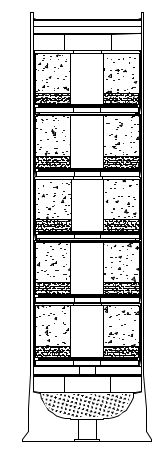
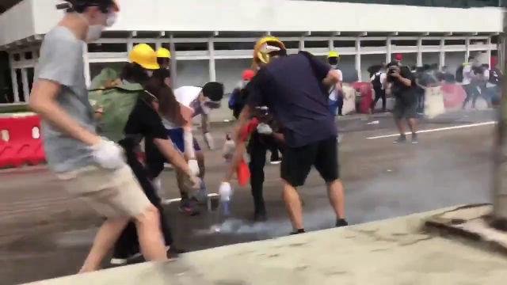

# MP-6M5-CS 槍發式催淚性毒氣彈

## 基本資料[DS][SDS]

* 一次發射5顆催淚性毒氣彈。
* 射程達80米。
* 每顆於15-25秒內釋放26克催淚性毒氣。
* 直徑38毫米。
* 內含燃料及氧化劑，毋須由空氣獲取氧氣亦能燃燒至超過300°C。
* 利用高熱氣化[2-Chlorobenzylidene malononitrile](cs_gas.md)。

## 反制方法

### 丟離

直接將毒氣彈丟離或丟去附近高處，有效性依賴臂力，技巧和風向。

### 搖散

放入金屬容器，如保溫瓶中，大力幅度搖動數秒。此方法效果佳，無需技巧和消秏資源。

### 球拍打回

以羽毛球拍或網球拍打回，有效性極度依賴臂力，技巧和風向。

### 淋水滅熄

[香港示威者滅熄毒氣彈](https://twitter.com/nvanderklippe/status/1138747496941756416)

毒氣彈著地後**立即**於中間排氣孔淋水，只需保持排氣孔表面有水覆蓋，使內裡粉末吸收水份飽和數秒，降溫熄滅。

### 水桶

![Turkey_protester_deal_with_cs_grenade.jpg]

[土耳其示威者應付毒氣彈](https://www.youtube.com/watch?v=piiKEd-NZyg)

丟入大水桶中，以水覆蓋，封密水桶直至毒氣彈降溫熄滅。一個水桶雖可同時處理多個毒氣彈，但此方法需要大量水和水桶，機動性亦極低，收集運動毒氣彈需時不少，丟入水桶時已釋放完大部份毒氣。

### 灑水空中

於空中灑水，阻止毒氣擴散，捕捉和分解毒氣。附近需有高壓水喉，如消防喉。無風或逆風時，水份弄濕呼吸過濾器。

------

[DS]MP-6M5-CS-MULTI-SMOKE PROJECTILE (CS) www.nonlethaltechnologies.com/pdf/DS/MP-6M5-CS.pdf
[SDS]www.nonlethaltechnologies.com/pdf/SDS/SDS-MP-6M5-CS.pdf
