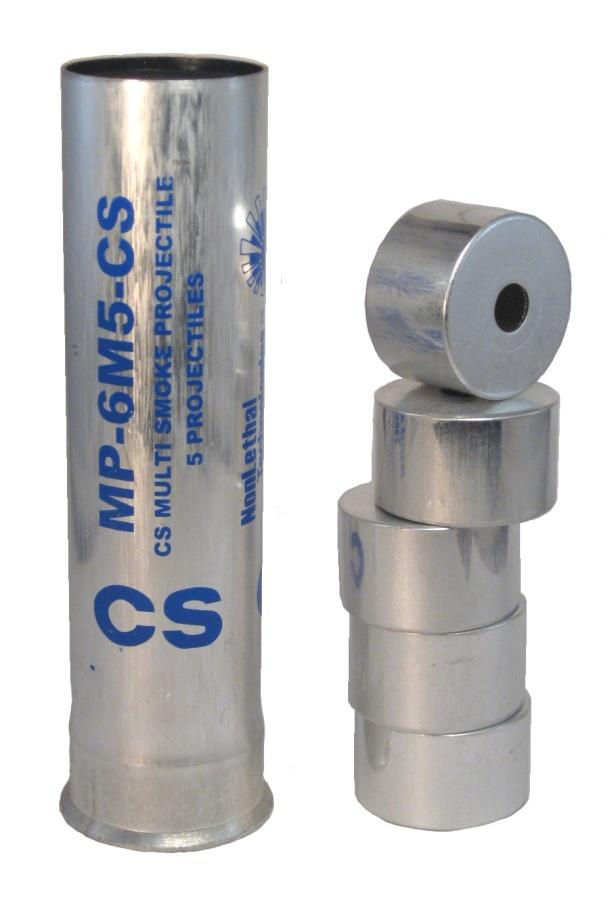

# MP-6M5-CS 槍發式催淚性毒氣彈

## 基本資料[DS][SDS]

* 一次發射5顆催淚性毒氣彈。
* 射程達80米。
* 每顆於15-25秒內釋放26克催淚性毒氣。
* 直徑38毫米。
* 內含燃料及氧化劑，毋須由空氣獲取氧氣亦能燃燒至超過300°C。
* 利用高熱氣化2-Chlorobenzylidene malononitrile。

------

[DS]MP-6M5-CS-MULTI-SMOKE PROJECTILE (CS) www.nonlethaltechnologies.com/pdf/DS/MP-6M5-CS.pdf
[SDS]www.nonlethaltechnologies.com/pdf/SDS/SDS-MP-6M5-CS.pdf
