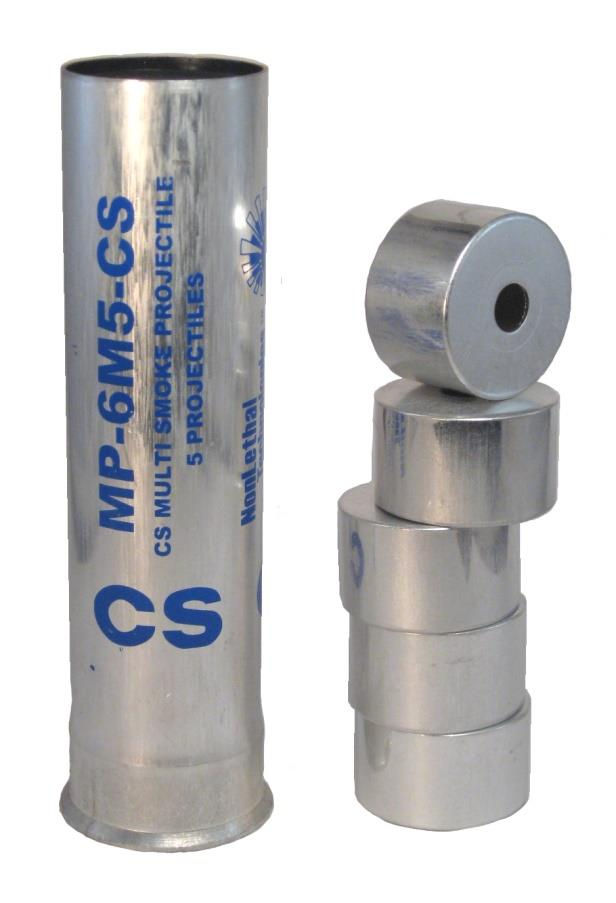

# CS催淚性毒氣

## 特性

* 融點93°C，沸點310°C[Hoenig, Steven L. (2006)]。
* 難溶於水，於20°C只有1-5g/L[ICSC]。
* 溶於亞司通(acetone), 二噁烷(dioxane), 二氯甲烷(methylene chloride), 乙酸乙酯(ethyl acetate), 苯(benzene)[Budavari, S. (ed.) 1996]。

## 分解

* 溶於水中會水解，於中性的水中半衰期是15分鐘；pH值9鹼性的水中，則是1分鐘[Blain 2003]。
* 界面活性劑可提升水溶性，其中陽性界面活性劑（如4價銨鹽消毒劑，過水時加入的柔順劑）會催化水解，非離子型界面活性劑會稍為抑制水解，陰性界面活性劑（如一般肥皂，洗潔精，洗衣粉）則大幅度抑制水解[KR101469461B1]。

|界面活性劑|離子|g/L(@10mM)|假一級反應率|
|---|:---:|:---:|:---:|
|無|||100%|
|溴化十六烷基三甲銨(CTABr)|陽性|3.64|127%|
|曲拉通X-100(Triton X-100)|非離子|6.47|89%|
|月桂基硫酸鈉(SLS)|陰性|2.88|53%|

* 加熱至分解時會釋放出毒氣：鹽酸，氧化氮和山埃[Lewis, R.J. Sax 1996]。

## 棄置

* 將固體混合於5倍體積的10%乙醇胺(monoethanolamine)和0.3%非離子型界面活性劑的水溶液。
* 將每100克固體混合於1公升5-15%氫氧化鈉(sodium hydroxide)的乙二醇(ethylene glycol)，乙醇(ethanol)或甲醇(methanol)溶液攪拌2小時[NIOSH 1981]。

------

[Hoenig, Steven L. (2006)]Hoenig, Steven L. (2006). Compendium of Chemical Warfare Agents. Springer. p. 138. ISBN 978-0-387-34626-7.

[ICSC]ILO International Chemical Safety Cards (ICSC) http://www.ilo.org/dyn/icsc/showcard.display?p_version=2&p_card_id=1065

[Budavari, S. (ed.) 1996][Budavari, S. (ed.). The Merck Index - An Encyclopedia of Chemicals, Drugs, and Biologicals. Whitehouse Station, NJ: Merck and Co., Inc., 1996., p. 354 https://toxnet.nlm.nih.gov/cgi-bin/sis/search/r?dbs+hsdb:@term+@rn+@rel+2698-41-1]

[Blain 2003] Blain, P.G. Tear gases and irritant incapacitants. 1-chloroacetophenone, 2-chlorobenzylidene malononitrile and dibenz[b,f]-1,4-oxazepine. Toxicol. Rev. 2003;22(2):103–110.

[Lewis, R.J. Sax 1996]Lewis, R.J. Sax's Dangerous Properties of Industrial Materials. 9th ed. Volumes 1-3. New York, NY: Van Nostrand Reinhold, 1996., p. 734 https://toxnet.nlm.nih.gov/cgi-bin/sis/search/r?dbs+hsdb:@term+@rn+@rel+2698-41-1

[NIOSH 1981]Mackison, F. W., R. S. Stricoff, and L. J. Partridge, Jr. (eds.). NIOSH/OSHA - Occupational Health Guidelines for Chemical Hazards. DHHS(NIOSH) Publication No. 81-123 (3 VOLS). Washington, DC: U.S. Government Printing Office, Jan. 1981.

[KR101469461B1]KR101469461B1 시위군중 해산용 2-클로로벤질리덴 말로노니트릴(ｃｓ)의 무독성화 방법 (Detoxification Method of 2-Chlorobenzylidene malononitrile (CS) as Riot Control Agent) https://patents.google.com/patent/KR101469461B1/en
